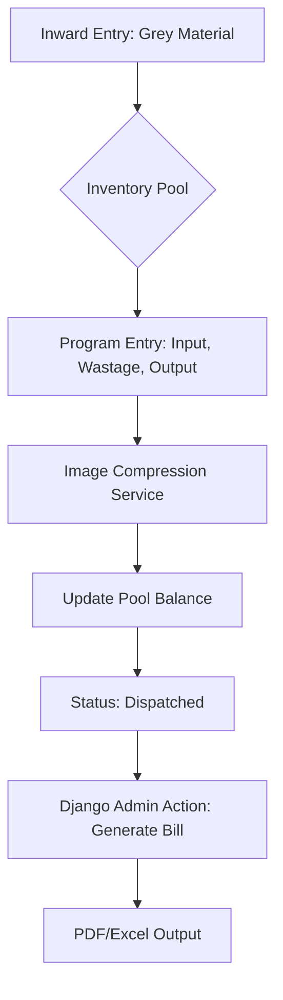

# # Project Specification: Textile Inventory & Billing System

## ## 1. Project Overview

A digital transition for textile units to manage the lifecycle of fabric from raw "Grey" material to finished goods. The system replaces manual ledgers with a **Headless Django** backend and a **Fragmented Logic** workflow to track inventory, manual wastage, and design photos.

---

## ## 2. Architecture & Tech Stack

* **Backend:** Django 5.x with **Django REST Framework (DRF)**.
* **Database:** PostgreSQL (SQL-based relational data).
* **Frontend:** Decoupled Application (React/Next.js or Flutter) via JSON APIs.
* **Storage:** Local or Cloud storage for **compressed images** (JPEG/WebP).
* **Core Utility:** `Pillow` for image processing and compression.

---

## ## 3. Core Business Logic: Unified Fragmented Model

The system treats every inward shipment as a "Balance Pool."

### ### The Inventory Pool

* All materials (White or Rayon) follow the same path.
* Each inward shipment creates a **Lot Number** (Resets annually every April 1st).
* Fragmented jobs ("Programs") are subtracted from the Lot's total meters.

### ### Manual Wastage Recording

Unlike automated systems, users manually record the "Ghat" (wastage) for every job:

* **Input ():** Meters pulled from the Grey pool.
* **Wastage ():** Manual entry of loss during processing.
* **Output ():** Actual finished meters for billing.
* **Formula:** .

---

## ## 4. Data Models (Django ORM)

| Model | Key Fields |
| --- | --- |
| **Party** | Name, Contact, Address. |
| **InwardLot** | Party (FK), Lot No, Quality Type, Total Meters, Current Balance. |
| **ProcessProgram** | InwardLot (FK), Input Meters, Wastage Meters, Output Meters, Design No, Design Photo, Status. |

> **Image Handling:** The `ProcessProgram` model overrides the `save()` method to compress images to a maximum width of 1200px and 70% quality before storage.

---

## ## 5. Application Workflow

---

## ## 6. Required Screens

### ### 1. Inward Log (Supervisor)

* **Purpose:** The entry point for all raw stock.
* **Features:** Record Party, Quality, and initial meterage.

### ### 2. Program Entry (Floor Staff)

* **Purpose:** Real-time recording of processing jobs.
* **Features:** Mobile-friendly camera integration for design photos; manual  entry.

### ### 3. Billing & Statement Hub (Admin)

* **Purpose:** Financial reconciliation.
* **Features:** Filter by date/party; consolidate multiple programs into a single invoice.

---

## ## 7. Django Admin Customizations

The Admin Panel is the primary "Command Center" for the owner:

* **Custom Actions:** * `generate_bill`: Selected programs  Combined PDF.
* `export_ledger`: Selected party  Yearly Excel Statement.

* **Visual Audit:** In-line thumbnails of compressed design photos in the list view.
* **Wastage Alerts:** Highlight entries where  of  in **Red**.

---

## ## 8. Key Features Checklist

* [ ] **Headless API:** DRF endpoints for all frontend actions.
* [ ] **Manual Override:** Ability to adjust balances in Admin for rounding errors.
* [ ] **Automatic Lot Sequencing:** Logic to handle annual resets.
* [ ] **Search & Filter:** Find any job by Design Number or Lot ID instantly.

